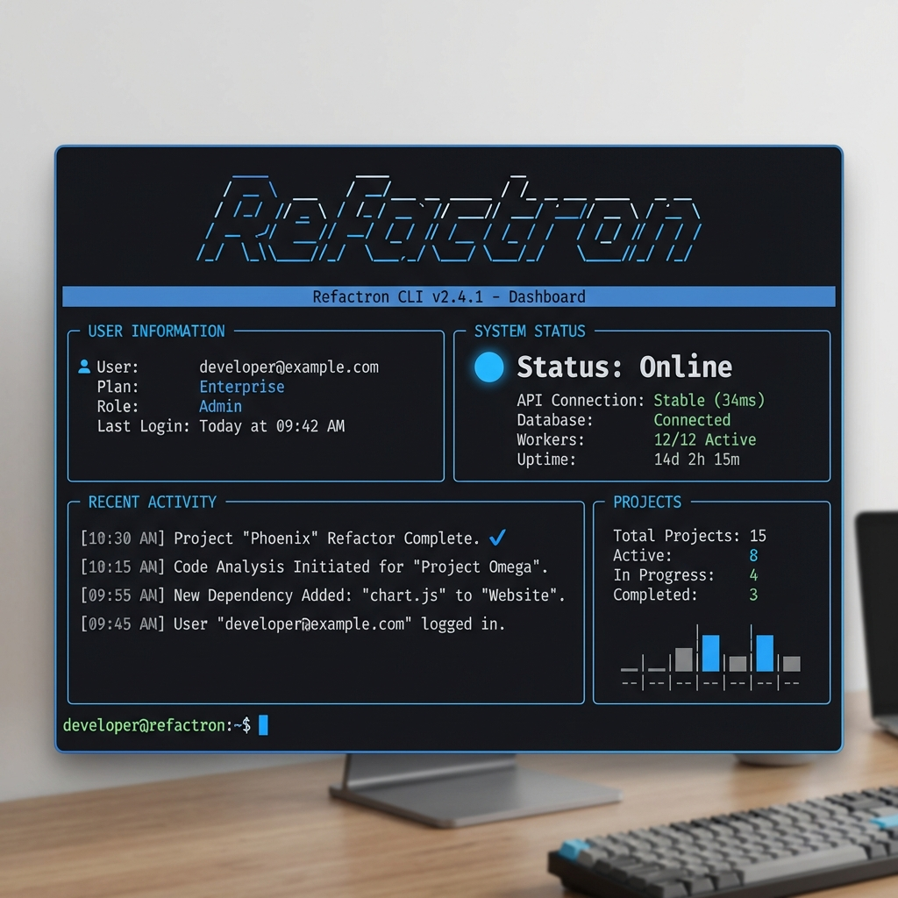

# Refactron

A Python library for code analysis and refactoring.

[](https://github.com/Refactron-ai/Refactron_lib/actions)
[](https://pypi.org/project/refactron/)
[](https://pypi.org/project/refactron/)
[](https://opensource.org/licenses/MIT)

## Overview

Refactron analyzes Python code for security vulnerabilities, performance issues, code smells, and complexity problems. It provides refactoring suggestions with safety previews and supports automated code fixes.



## Features

### Code Analysis

- **Security scanning**: SQL injection, code injection, hardcoded secrets, SSRF vulnerabilities
- **Code quality**: magic numbers, long functions, excessive parameters, deep nesting
- **Complexity metrics**: cyclomatic complexity, maintainability index, nested loops
- **Type hints**: missing or incomplete annotations
- **Dead code detection**: unused functions and unreachable code
- **Dependency analysis**: circular imports, wildcard imports
- **Performance issues**: N+1 queries, inefficient iterations

### Pattern Learning System

Refactron now learns from your project-specific coding standards.
- **Pattern Learning Engine**: Identifies and learns project-specific refactoring patterns.
- **Intelligent Ranking**: Ranks suggestions based on risk and potential impact.
- **Feedback Loop**: Improves accuracy over time based on your feedback.

### Performance & Scalability

Optimized for large-scale codebases.
- **AST Cache**: Blazing fast repeated analysis.
- **Incremental Analysis**: Only process files modified since the last run.
- **Parallel Processing**: Multi-threaded execution for maximum speed.

### Refactoring & Auto-Fix

- **Extract constants**, simplify conditionals, reduce parameters, add docstrings, extract methods.
- **14 automated fixers** for common issues with configurable safety levels.
- **Preview changes** before applying with risk scoring.
- **Backup & Rollback**: Git-integrated safety system to undo changes.

## Installation

```bash
pip install refactron
```

## Usage

### Command Line

Refactron features a modern, interactive CLI.

```bash
# Log in to Refactron
refactron login

# Analyze code (requires authentication)
refactron analyze myproject/

# Generate report
refactron report myproject/ --format json -o report.json

# Preview refactoring suggestions
refactron refactor myfile.py --preview

# Auto-fix issues
refactron autofix myfile.py --apply

# Rollback changes
refactron rollback --list
refactron rollback --session <id>
```

### Python API

```python
from refactron import Refactron

refactron = Refactron()
analysis = refactron.analyze("path/to/code.py")
print(analysis.report())

result = refactron.refactor("path/to/code.py", preview=True)
result.show_diff()
```

## Documentation

- [Pattern Learning Guide](docs/PATTERN_LEARNING.md)
- [Quick Reference](docs/QUICK_REFERENCE.md)
- [Tutorial](docs/TUTORIAL.md)
- [Architecture](ARCHITECTURE.md)
- [Contributing Guide](CONTRIBUTING.md)

## Development Status


Stable release (v1.0.14). Tested on Python 3.8-3.12.

- 669 tests, 78% code coverage
- Validated on 10,000+ lines of production code
- CI/CD ready with GitHub Actions and GitLab CI templates

## Contributing

Contributions are welcome. See [CONTRIBUTING.md](CONTRIBUTING.md) for guidelines.

```bash
git clone https://github.com/Refactron-ai/Refactron_lib.git
cd Refactron_lib
bash setup_dev.sh
```

## Security

Report security issues to security@refactron.dev See [SECURITY.md](SECURITY.md) for details.

## License

MIT License - see [LICENSE](LICENSE) for details.
