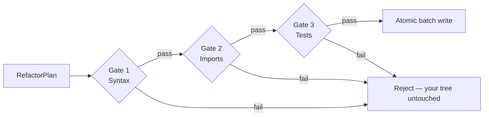

Refactron's moat is what happens **before** a write, not how clever the rewrite is. Every refactor plan passes through three verification gates and a single atomic batch-write step. If any gate rejects, your working tree is untouched.

> **Inviolable Rule #4:** Verification runs before every write. Atomic write protocol always.

## The 3 gates

Each gate operates on the **proposed-new-content** string for every `FileChange` in the plan. Nothing in the gate path reads or writes your real working tree until the final atomic step.

---

## Gate 1 — Syntax

Re-parse the new content for each `FileChange` in the plan.

- **Python:** LibCST parses the proposed source. A failure means a malformed transformation slipped past the refactorer (a bug we want to catch).
- **TypeScript:** ts-morph collects diagnostics on the proposed source. Compiler diagnostics with category `Error` reject the file.

If any file fails to parse, the gate rejects with a clear `blockingReason` naming the offending file. The plan is dropped; nothing else runs.

**Typical wall-clock:** ~50ms for a small batch.

---

## Gate 2 — Imports

Build a dependency graph from the proposed-new-content trees and resolve every import.

- **Python:** collect `import X` and `from X import Y` statements; resolve against `sys.path` plus the project tree.
- **TypeScript:** ts-morph `getImportDeclarations()` plus `getModuleSpecifierSourceFile()` for each import.

**Reject conditions:**

- A newly-introduced import in the new content does not resolve.
- An import that previously resolved in a changed file now fails (e.g. transform deleted a re-exported symbol).

This catches the most common refactor-induced breakage: the rewrite is locally valid but quietly orphans a downstream module.

**Typical wall-clock:** ~50ms.

---

## Gate 3 — Tests

The most expensive gate, and the only one that runs **your** code.

1. **Build a shadow tree** — a temp directory copy of the project root. Unchanged files are hardlinked (cheap, instant). Files in the plan are written from the proposed new content.
2. **Detect the test runner** by looking for a config file in the project root:
   - `vitest.config.{ts,js,mjs}` → `vitest run`
   - `jest.config.{ts,js,cjs,json}` → `jest`
   - `pyproject.toml` with `[tool.pytest.*]` or `pytest.ini` → `pytest`
   - User can override via `.refactronrc.json` `testCmd: "<command>"`.
3. **Run the baseline first** — execute the runner against the **unchanged** copy. If the baseline already fails, abort with `your tests don't pass before refactoring` rather than blame the refactor for pre-existing failures.
4. **Run the mutated** — same runner, same temp tree, with the proposed changes in place. Any non-zero exit rejects the plan.

**Typical wall-clock:** dominated by the user's own suite size. The default per-gate timeout is 45s; raise via `verification.timeout_seconds` for slower suites.

---

## Atomic batch write protocol

Once all three gates pass, the verifier hands a list of `(path, newContent)` pairs to `writeBatchAtomic`. Each write uses `write-file-atomic`:

1. Write the new content to a sibling temp file (`<path>.refactron-tmp-<rand>`).
2. `fsync` the temp file.
3. POSIX `rename` (`MoveFileExW` on Windows) the temp over the real path. This rename is atomic at the filesystem layer.

**The contract:** either every change in the plan commits, or none do. There is no intermediate state where one file has the new content and another still holds the old. If a write fails midway, the verifier aborts the batch and the partially-written temp files are cleaned up — your real tree never sees the inconsistent intermediate.

---

## Cross-file preconditions

Some transforms need to know whether **other files in the project** depend on the surface they're about to mutate. These transforms walk the import graph for the target file and skip themselves rather than break a cross-file caller:

- [`callback_to_async_await`](/transforms/callback-to-async-await) — skips when an external file imports the function and passes a callback at the call site.
- [`deprecated_api_requests_to_httpx`](/transforms/deprecated-api-requests-to-httpx) — skips when an external file references `<module>.requests` (including `unittest.mock.patch` string targets).

The cross-file check runs during planning (before Gate 1) so the transform never produces a plan it knows would orphan a caller.

---

## Citations

The three-gate model traces back to Bill Opdyke's 1992 PhD thesis on behaviour-preserving refactoring at UIUC — the original formal treatment of preconditions before automated source transformation.

- Opdyke, William F. *Refactoring Object-Oriented Frameworks.* PhD thesis, University of Illinois at Urbana-Champaign, 1992. [PDF](https://www.cs.umd.edu/users/atif/Refactoring.pdf)
